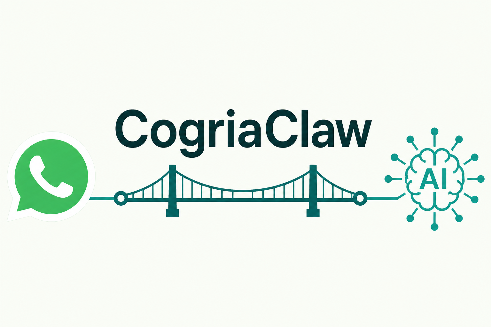

<div align="right">

[English](./README.md) | **简体中文**

</div>

<p align="center">
  
</p>

# CogriaClaw

> 一个连接 WhatsApp 与大模型的极简工具。轻量、实用、不臃肿。

CogriaClaw 是一个 Go 编写的单二进制服务，把一个 WhatsApp 账号接到大模型上。它接收白名单好友/群的消息，交给一个能调用工具、遵循技能的大模型处理，然后回复。同时提供一个极简 HTTP API，让外部系统主动推消息或触发任务。

## 设计原则

- **轻量** —— 单一静态二进制，零运行时依赖，无 CGO
- **实用** —— 白名单、群内 @ 触发、tool-use、技能、HTTP 触发，到此为止
- **不臃肿** —— 没有插件市场、没有多渠道抽象层、没有"记忆框架"。你不需要的东西，这里就没有

## 它跟别的有什么不一样

- 不用 Puppeteer / 无头浏览器 —— 底层是 [whatsmeow](https://github.com/tulir/whatsmeow)，纯 Go 实现 WhatsApp Web 协议
- 任意 OpenAI 兼容大模型（Kimi、Moonshot、DeepSeek、OpenAI、Groq、OpenRouter、本地 Ollama……）—— 配置里换后端，不改代码
- nginx 式进程控制：`reload` 热重载配置不断连接；可自安装为 launchd/systemd 服务
- 一份配置文件，一个进程，一件事可调

## CogriaClaw 与 Openclaw 的对比

CogriaClaw 最初是 **Openclaw** 里 WhatsApp 通道的极简重写。Openclaw 是一个 Node.js 机器人框架 —— 一套插件/通道 SDK，让同一份代码横跨多个消息平台、多个账号。CogriaClaw 只保留 WhatsApp ↔ 大模型这一条路，刻意把外面那层框架全砍掉。这是不同的设计取舍，不是 fork —— 按你真正需要多少来选。

| | CogriaClaw | Openclaw |
|---|---|---|
| 运行时 | 单一静态 Go 二进制，零运行时依赖 | Node.js + npm 依赖树 |
| WhatsApp 传输 | [whatsmeow](https://github.com/tulir/whatsmeow)（纯 Go 实现 WA-Web 协议） | Baileys（`@whiskeysockets/baileys`） |
| 范围 | 一个 WhatsApp 账号 ↔ 一个大模型 | 多通道、多账号机器人框架 |
| 扩展方式 | 内置工具（Go）+ `SKILL.md` 技能 | 插件 / 通道 SDK |
| 配置 | 一份 `config.yaml` | 分层的插件 + 通道配置 |
| 运维 | 自安装为 launchd/systemd，`reload` 热重载 | 框架自带的进程模型 |
| 体积 | ~20 MB 二进制，拷过去就能跑 | Node 运行时 + `node_modules` |

**选 CogriaClaw**：单账号、单机、尽量少的活动部件。**选 Openclaw**：需要多通道、多账号，或它的插件生态。

## 快速开始

需要 Go 1.23+ 编译。

```sh
git clone https://github.com/Cogria-AI/cogriaclaw
cd cogriaclaw
go build -o cogriaclaw .              # 或：make build（带版本信息并裁剪体积）

cp config.example.yaml config.yaml   # 然后编辑：白名单、大模型 key 等
./cogriaclaw run                      # 用 WhatsApp 扫码登录
```

要给别的机器编译（比如 Linux 服务器）？`make build-all` 交叉编译到 `dist/`（darwin/linux × amd64/arm64）；`make package` 再打 tar.gz + 校验和。全程关掉 CGO，是纯交叉编译 —— 把二进制拷过去直接跑。

首次启动终端会打印 QR 码，用 **WhatsApp → 设置 → 已关联的设备 → 关联设备** 扫码。session 存在 `data/` 下，之后启动无需再扫码。

用白名单内的号给登录账号发消息，它就会经大模型回复。发 `/new`（可配置）开新会话。

### 装成后台服务

`install` 会把二进制拷到 `~/.local/bin`，把配置 + 技能 + session 拷到 `~/.cogriaclaw`，并注册一个 launchd(macOS)/systemd(Linux) 用户级服务。如果已登录就直接启动；否则先登录一次再启动：

```sh
./cogriaclaw install      # 安装 + 注册服务
./cogriaclaw run          # 仅首次：扫码登录后 Ctrl+C
cogriaclaw start          # 启动后台服务

cogriaclaw status         # 是否在跑？
cogriaclaw reload         # 不断 WhatsApp 连接，热重载配置
cogriaclaw restart
cogriaclaw stop
cogriaclaw uninstall      # 停止 + 移除服务
```

`run` 是前台模式（日志打到终端，关终端即停）。装好的服务由系统服务管理器托管 —— 注销/重启都活着、崩溃自动重启。`reload`（SIGHUP）热生效：白名单、技能、system prompt、LLM 设置；`api.listen`、`data.dir` 和 WhatsApp 账号需要完整重启。全部命令见 `cogriaclaw help`。

## 配置

一切都在一份 `config.yaml`（见 [`config.example.yaml`](./config.example.yaml)）。要点：

- **`filter`** —— `allowed_dms`（E.164 号码）和 `allowed_groups`（群 JID）。其他来源一律 drop。`group_require_mention` 控制群里是否要 @ 才回。
- **`llm`** —— `base_url` + `api_key` + `model` 选任意 OpenAI 兼容后端；`headers`、`extra_body` 处理各家差异；`${ENV_NAME}` 插值让 key 不进文件。
- **`conversation`** —— 按 chat 的内存短期会话；`reset_command`（默认 `/new`）开新会话。不落盘。
- **`api`** —— 可选 HTTP 控制接口（见下），建议只绑 localhost。

## 工具与技能

两层：

- **工具（Tools）** 是模型直接调用的函数原语 —— `http_get`，以及 `read_file`、`run_script`（两者都锁死在 skills 目录内）。Go 实现。
- **技能（Skills）** 是 `skills/` 下的 `SKILL.md` 文件夹（markdown 指令 + 可选附带脚本）。模型只看到每个技能的 name + description；命中时读 `SKILL.md` 并按其指令、用工具去落地。这套渐进式加载对应 [Anthropic Agent Skills](https://platform.claude.com/docs/en/agents-and-tools/agent-skills/overview) 模型。

示例见 [`skills/server-time/`](./skills/server-time/)。`run_script`（文件夹内脚本执行）需通过 `skills.exec.enabled` 显式开启。

## HTTP API

设置 `api.listen`（和 bearer `api.token`）即启用。建议只绑 localhost，对外暴露用你自己的 tunnel/反代。

| 端点 | 鉴权 | 用途 |
|---|---|---|
| `GET /healthz` | 无 | 存活 + WhatsApp 连接状态 |
| `POST /send` | bearer | 直接发消息，不过模型 |
| `POST /trigger` | bearer | 执行一个工具，可选把结果推到指定 chat |

```sh
curl -XPOST localhost:8787/send -H "Authorization: Bearer $TOKEN" \
  -d '{"to":"+447700900123","text":"hello"}'

curl -XPOST localhost:8787/trigger -H "Authorization: Bearer $TOKEN" \
  -d '{"tool":"http_get","input":{"url":"https://example.com"},"notify":{"to":"+447700900123"}}'
```

## 文档

- [运维指南](./docs/operations.md) —— 安装、命令、日志、更新、排错
- [配置说明](./docs/configuration.md) —— 配置参考;如何换大模型/供应商/参数
- [工具与技能](./docs/skills.md) —— 工具 vs 技能、如何写 SKILL.md
- [HTTP API](./docs/api.md) —— 接口与任务触发

> 文档正文为英文(公开仓库语言约定)。

## 免责声明

CogriaClaw **与 WhatsApp、Meta、Anthropic 均无任何关联**。本项目通过第三方 [whatsmeow](https://github.com/tulir/whatsmeow) 库与 WhatsApp Web 协议交互；运行该软件可能违反 WhatsApp 服务条款，并可能导致账号被封禁。软件按"原样"提供，不附任何担保（详见 [LICENSE](./LICENSE)）。仅供个人、教育及经授权的自动化用途 —— **不得用于未经请求的群发消息**。

## 许可证

[MIT](./LICENSE)
